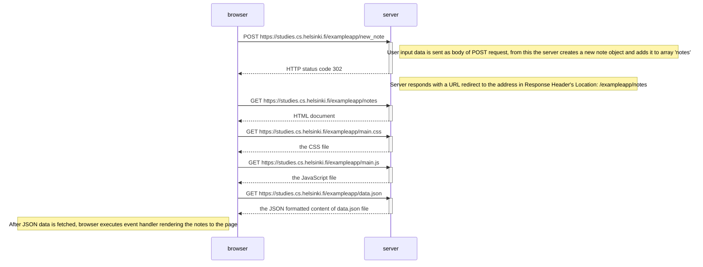

```mermaid
sequenceDiagram
    participant browser
    participant server

    browser->>server: POST https://studies.cs.helsinki.fi/exampleapp/new_note
    activate server
    Note right of server: User input data is sent as body of POST request, from this the server creates a new note object and adds it to array 'notes'
    server-->>browser: HTTP status code 302
    deactivate server
    Note right of server: Server responds with a URL redirect to the address in Response Header's Location: /exampleapp/notes

    browser->>server: GET https://studies.cs.helsinki.fi/exampleapp/notes
    activate server
    server-->>browser: HTML document
    deactivate server

    browser->>server: GET https://studies.cs.helsinki.fi/exampleapp/main.css
    activate server
    server-->>browser: the CSS file
    deactivate server

    browser->>server: GET https://studies.cs.helsinki.fi/exampleapp/main.js
    activate server
    server-->>browser: the JavaScript file
    deactivate server

    browser->>server: GET https://studies.cs.helsinki.fi/exampleapp/data.json
    activate server
    server-->>browser: the JSON formatted content of data.json file
    deactivate server

    Note left of browser: After JSON data is fetched, browser executes event handler rendering the notes to the page
```