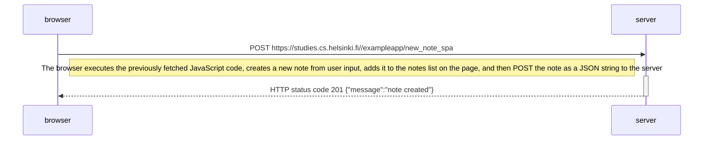

```mermaid
sequenceDiagram
    participant browser
    participant server

    browser->>server: POST https://studies.cs.helsinki.fi//exampleapp/new_note_spa
    Note right of browser: The browser executes the previously fetched JavaScript code, creates a new note from user input, adds it to the notes list on the page, and then POST the note as a JSON string to the server
    activate server
    server-->>browser: HTTP status code 201 {"message":"note created"}
    deactivate server
```